# 🚴‍♂️ Pedalion

Pedalion is a modern iOS shopping app focused on bicycles and cycling accessories.  
It provides a smooth browsing experience, cart management, checkout flow, and order tracking — all wrapped in a clean and visually appealing UI.

---

## ✨ Features

- 🛒 Browse bicycles & accessories by category  
- ❤️ Add and remove items from cart  
- ➕ Quantity management inside cart  
- 🎟 Apply coupon codes  
- 📦 Smooth checkout flow with input validation  
- ✅ Order success screen  
- 📑 Order history with expandable order details  
- 🗑 Swipe-to-delete cart items  
- 🌈 Custom backgrounds and polished UI  

---

## 📱 Screens Implemented

- Home  
- Product Listing  
- Product Details  
- Favourites
- Cart  
- Checkout  
- Order Success  
- Orders  

---

## 🛠 Tech Stack

- Swift  
- SwiftUI  
- MVVM Architecture  
- NavigationStack  
- Environment & State Management  
- ScrollView & LazyVStack  
- ContentUnavailableView  

---

## 🎨 Design Credits

The UI/UX design of **Pedalion** is inspired by a Figma design created by **Sourasith**.

All design credits go to her 👏

- **Designer:** Sourasith  
- **Figma Profile:**  
  https://www.figma.com/@SourasithP  

This project is a development implementation of her design for learning and practice purposes.

---

## 📸 Screenshots

<table>
  <tr>
      <td align="center">
      <strong>Home</strong> 
      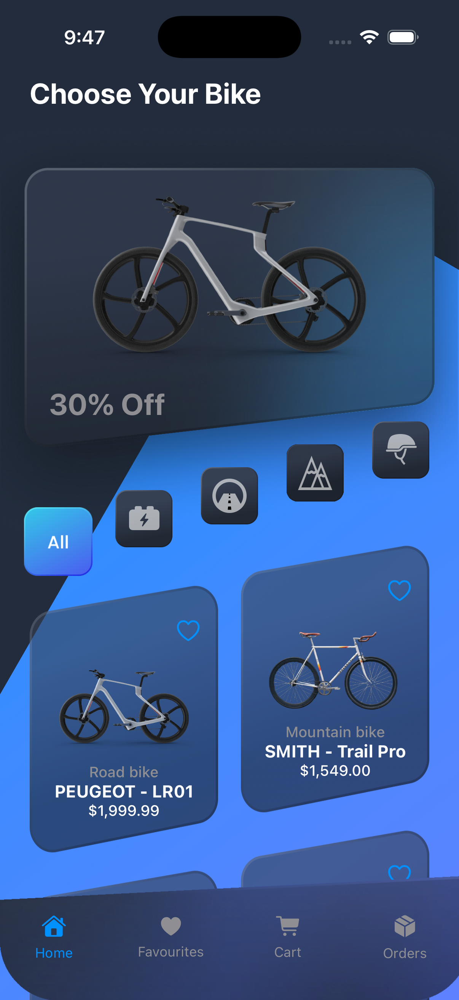
    </td>
      <td align="center">
      <strong>Empty Favourites Page</strong> 
      
    </td>
    <td align="center">
      <strong>Empty Cart Page</strong> 
      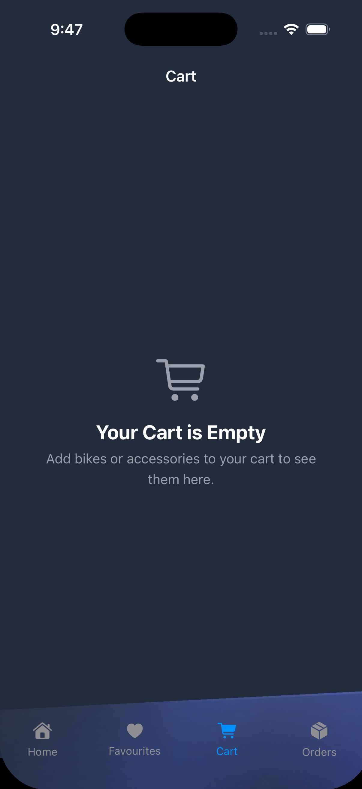
    </td>
        <td align="center">
      <strong>Empty Order Page</strong> 
      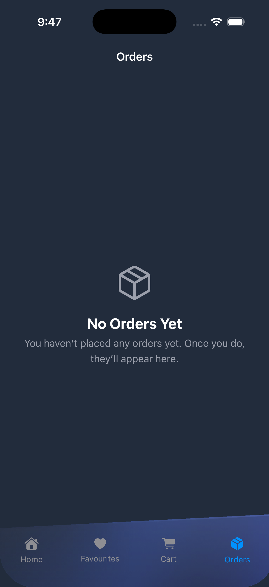
    </td>
  </tr>
  <tr>
    <td align="center">
      <strong>Details Page 1</strong> 
      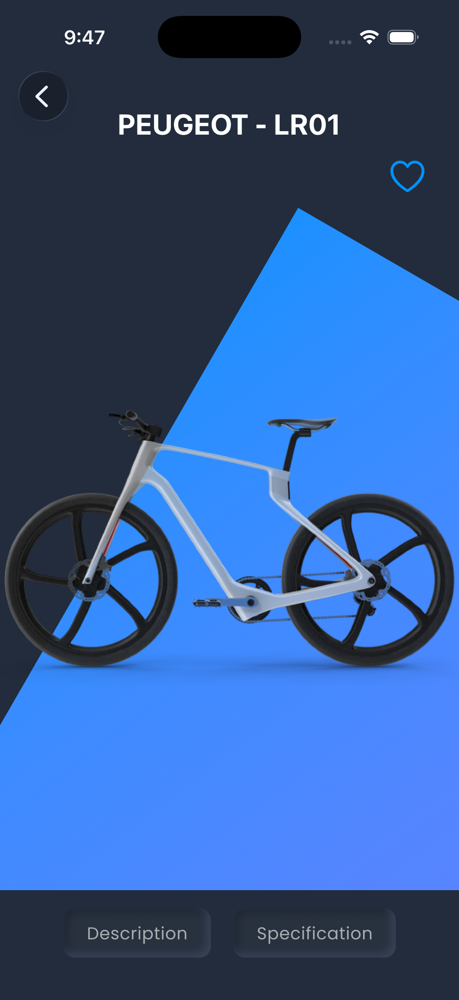
    </td>
    <td align="center">
      <strong>Details Page 2</strong> 
      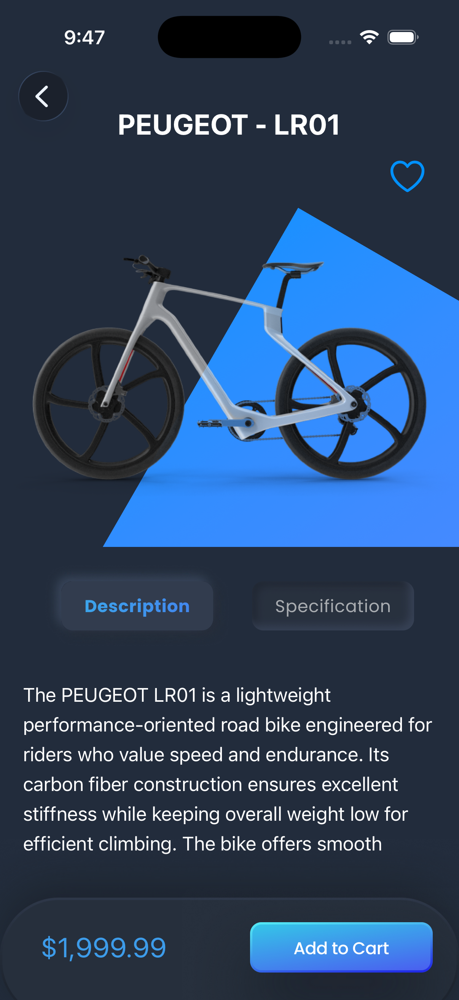
    </td>
        <td align="center">
      <strong>Details Page 3</strong> 
      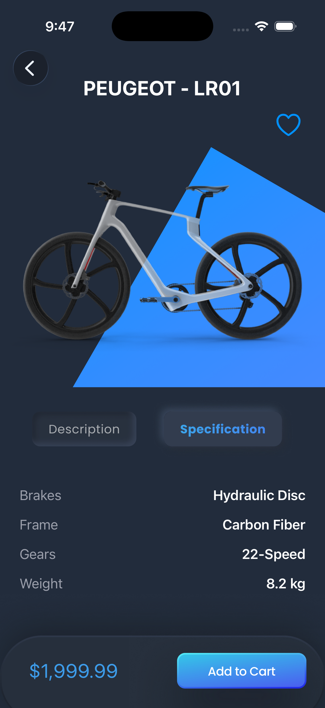
    </td>
            <td align="center">
      <strong>Favourites Page</strong> 
      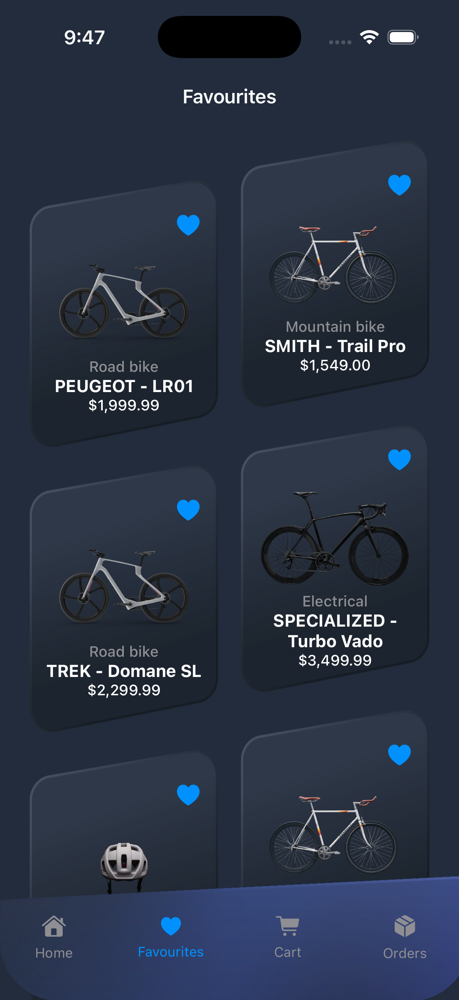
    </td>
  </tr>
    <tr>
    <td align="center">
      <strong>Cart Page 1</strong> 
      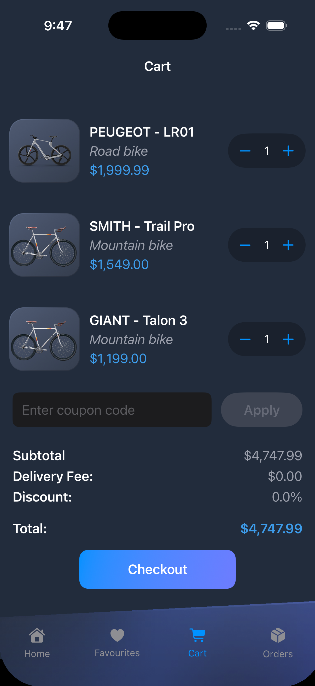
    </td>
    <td align="center">
      <strong>Cart Page 2</strong> 
      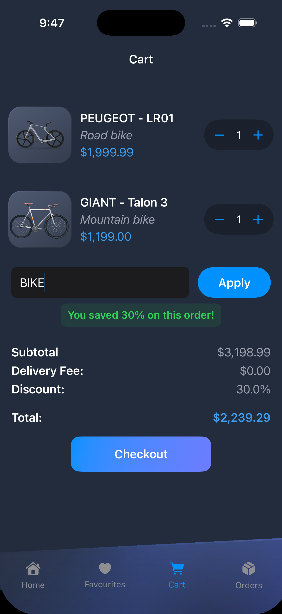
    </td>
        <td align="center">
      <strong>Shipping Address Page</strong> 
      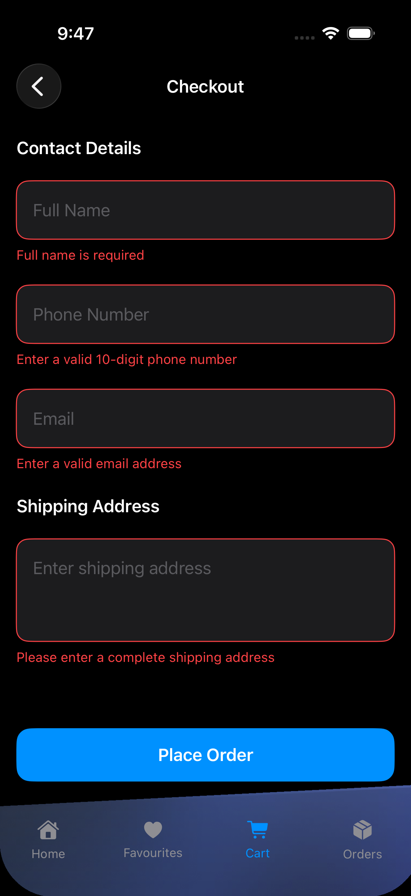
    </td>
            <td align="center">
      <strong>Order Placed Page</strong> 
      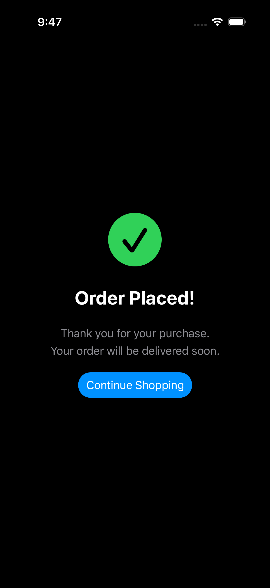
    </td>
  </tr>
    <tr>
      <td align="center">
      <strong>Orders Page</strong> 
      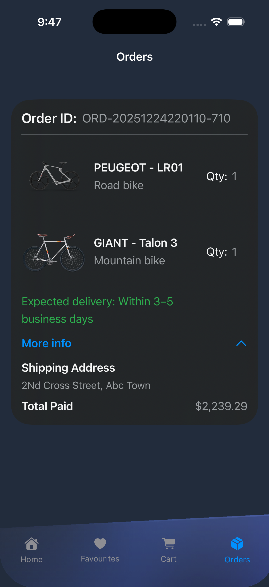
    </td>
  </tr>
</table>

---

## 🚀 Purpose of This Project

- Improve SwiftUI skills  
- Practice real-world app architecture  
- Build a complete shopping flow  
- Convert Figma designs into a production-ready iOS app  

---

## 🙌 Acknowledgements

- Apple SwiftUI Documentation  
- SwiftUI Community  
- **Sourasith** for the amazing Figma design inspiration  

---

## 📌 License

This project is created for **educational and portfolio purposes** only.
